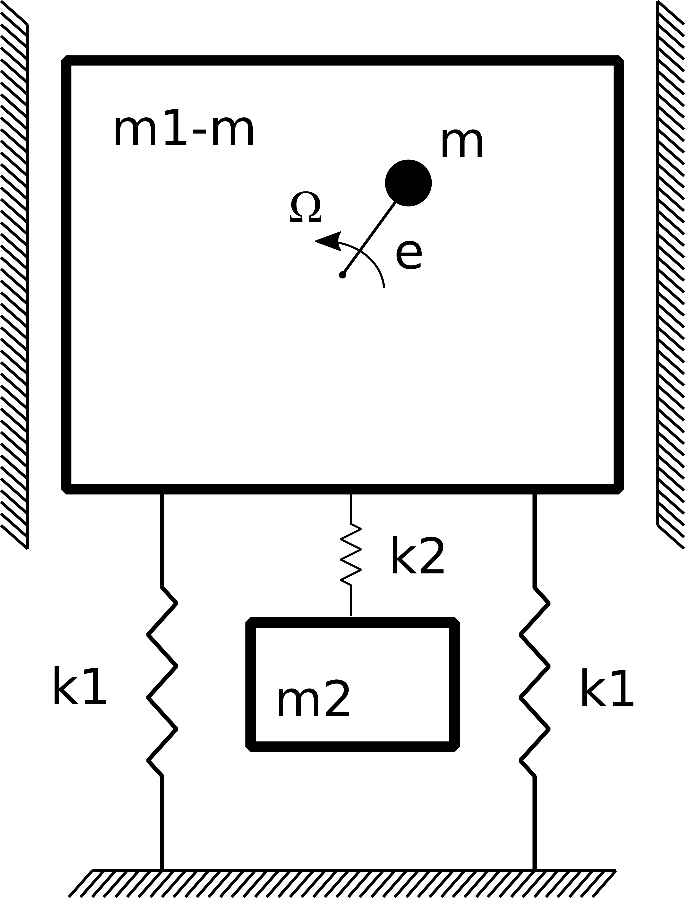
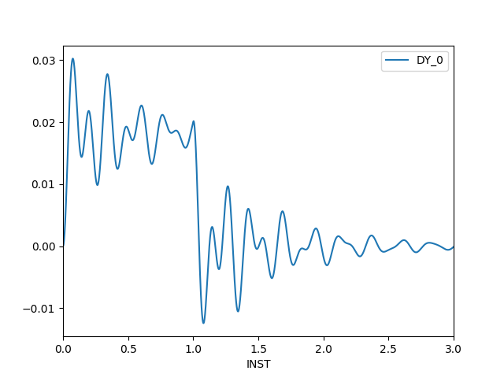

# Mass synchronization

+ Modal Analysis
+ Discret Elements

 File                                   | Contents    
 :-------------                         | :-------------
 [2dof.comm](2dof.comm)                 | Code_Aster command file
 [2dof.mail](2dof.mail)                 | Mesh in code_aster format
 [2dofStudy.export](2dofStudy.export)   | Export file for code_aster
 [2dof.py](2dof.py)                     | Python script to solve the problem

## Model Description

The model consits of one mass conected to the ground by two springs of k1 stiffnes. 
From this mass hangs other mass connected by one spring of k2 stiffness.
Inside the first mass, there is one small mass rotating at 1000 r.p.m  with an excentricity
of 0.2m



Parameters   | Value
:----------  | :-------------
m1           | 0.370 t
m2           | 0.100 t
m            | 0.005 t
k1           | 300 kN/m
k2           | 100 kN/m
e            | 0.20 m
omega        | 1000 r.p.m

## Reference Solution

The reference solution is obtained with the python script [2dof.py](2dof.py), which
prints the natural frequencies and the matrices normalized by mass.


## PreProcessing

Beacause this is a very simple model, the geometry of the mesh is created directly 
in [2dof.mail](2dof.mail)
    
## Solving
    
### Code_Aster

To launch the study:
```
$ as_run 2dofStudy.export
```

The solver generetaes the following files:

 File                                   | Contents    
 :-------------                         | :-------------
 2dof.resu                              | Result file with the values of the frequencies
 mass.csv                               | Mass matrix normalized by mass
 stiffness.csv                          | Stiffness matrix normalized by mass
 2dof.csv                               | Displacements of the top mass


## Postprocessing

Using the script [plot.py](plot.py), that processes the file 2dof.csv,
one obtains the following plot for the displacement of the mass on top.



