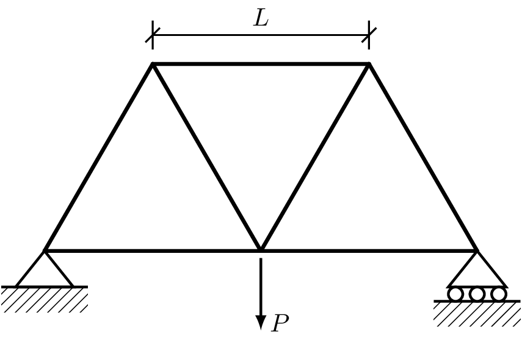
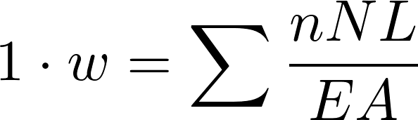
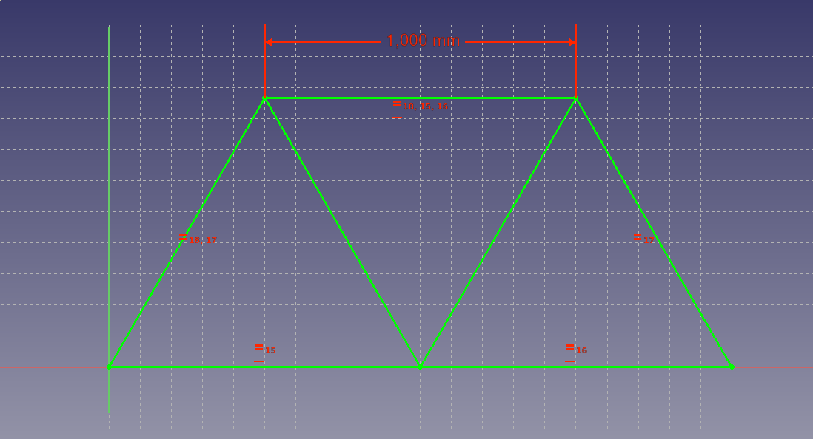
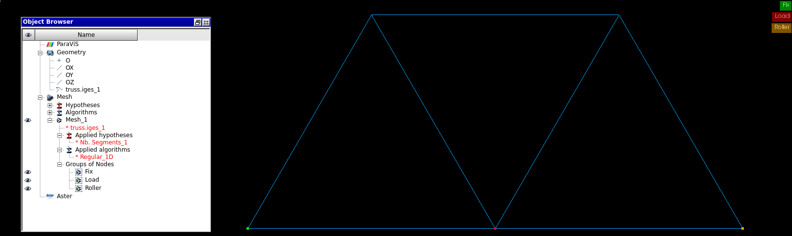
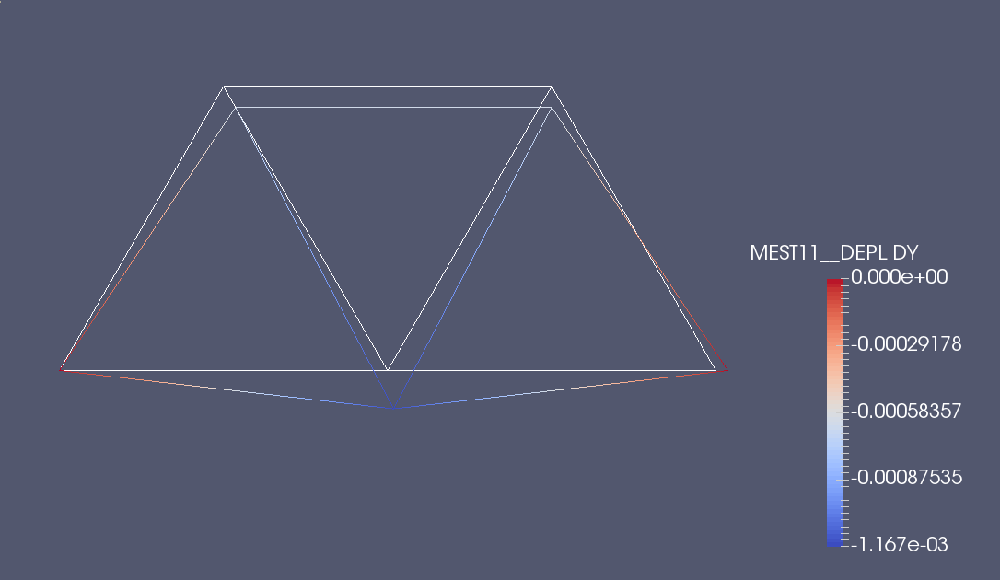
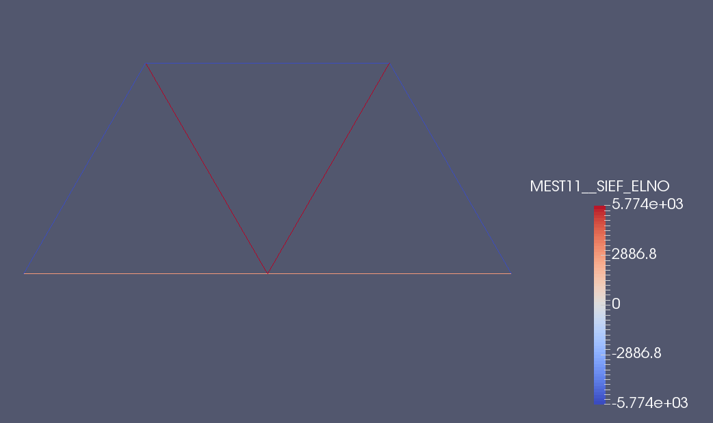

# Truss analysis 

+ Static Analysis
+ Truss elements
+ Point Load 

 File                                                  | Contents    
 :-------------                                        | :-------------
 [truss.fcstd](truss.fcstd)                             | FreeCAD file with the sketch of the model
 [truss.iges](truss.iges)                              | IGES file exported from FreeCAD
 [truss.hdf](truss.hdf)                                | Salome Study with the mesh groups 

## Model Description

The model is a simple statically determinate truss with a load  P in the center node. 
All the bars have a circular section of radius r and length L.



Parameters  | Value
:---------- | :-------------
P           | 10000 N
E           | 200E9 N 
r           | 0.005 m

## Reference Solution

Calculating the axial force of the bars and applying equilibrium at each node one gets:

Bar           | Normal Force
:----------   | :--------------
N1            | -5773.50 N
N2            | 2886.75 N
N3            | 5773.50 N
N4            | -5773.50 N

Applying the principle of virtual work to obtain de displacement on the center node
<p  align="center">
   
</p>

+ w = 1.164e-3 m

## PreProcessing
### Geometry
The geometry is created using the sketcher in FreeCAD



### Mesh

The mesh and mesh groups are genereated with the mesh module of salome


    
## Solving
### Calculix

 File                                                  | Contents    
 :-------------                                        | :-------------
 [truss.inp](calculix/truss.inp)                       | Input file for calculix
 [truss.unv](calculix/truss.unv)                       | Mesh in format unv

After exporting the mesh from salome to unv format, the mesh has to be converted to .inp format,
this can be done with [Calculix Launcher](http://calculixforwin.blogspot.com.es/2015/05/calculix-launcher.html).

To launch the file, go to the directory where truss.inp is and:
```
$ ccx truss
```
    
### Code_Aster

 File                                                  | Contents    
 :-------------                                        | :-------------
 [truss.comm](code_aster/truss.comm)                   | Command file for code_aster
 [truss.med](code_aster/truss.med)                     | Mesh in med format
 [trussStudy.export](code_aster/trussStudy.export)     | Export file for launching the study

The mesh can be obtained directly exporting it from salome, no need to convert it to other format.

To launch the study:
```
$ as_run trussStudy.export
```

## Postprocessing

The results file from code aster "trussStudy.rmed", has to be processed with the salome version of 
Paraview, Paravis.

To get the deformed shape the "Generate Vectors" option has to be clicked before reading the results.
After that applying a warp by vector filter and adjusting the scale factor gives the following result.



To get the axial forces, first a "ELNO Mesh" filter has to be used so the results of element nodes can 
be visualized.


